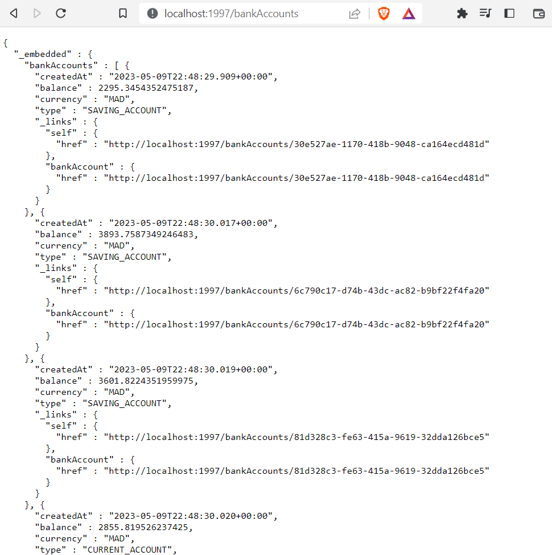

# Architectures Microservices

### 1. DAO layer test
From the link http://localhost:1997/h2-console we generate the database interface. The following figure shows this interface.

### 2. Test microservice web using a REST client like Postman
The figure above represents the list of customers generated using REST, it is accessible via the link http://localhost:1997/bankAccounts.

With the Postman software allowing us to test the different REST functions. The following figures present the different functions such as obtaining the list of customers or a customer from its id, as well as adding or modifying a customer.

### 3. Generating and testing Swagger documentation of Web service Rest APIs
* Swagger interface obtained from link http://localhost:1997/swagger-ui/

* Documentation generated by Swagger from http://localhost:1997/v3/api-docs

* List of clients using Swagger 

* Importing Swagger documentation to Postman

Expose a Restful API using Spring Data Rest by leveraging projections
* List of clients using Spring Data Rest

* Obtaining a customer from his id 

* List of customers by their type of account by the link http://localhost:1997/bankAccounts/search/findByType?type=CURRENT_ACCOUNT

* List of clients with the "p1" projection of the link http://localhost:1997/bankAccounts?projection=p1

### 5. Creation of the DTOs and Mappers and of the Service layer (business) of the micro service
* DTOs

* Mappers

* Services

### 6. Creating a GraphQL web service
* Display of the list of accounts using the accountsList function of type query

* Displaying an account by its id using the accountById query type function

* Display of the error case where the id is invalid 

* Adding an account using variables

* Confirmation of addition

* Modification of a count using variables

* Deleting an account

* Display of the database with the relations between Customer and BankAccount

* Display of the list of accounts with the names of their Customers

* Display of the list of customers with the balance of their accounts

